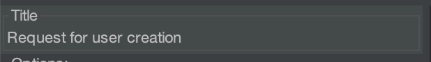
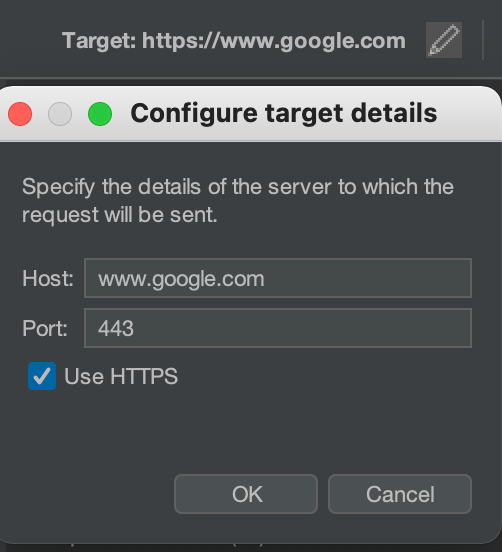

# Templates
Default template looks like this:

# Keyworded Templates
User can utilize a set of keywords 
## Title
PoC step title i.e *Request for user creation* 
* Template: `_title_`
* Input: Value from Title field, available from Repeater tab
  
* Output: `Foo bar`
## Target 
Burp Repeater allows to set the target 
* Template: `_target_`
* Input: Value from Target section
  
  
* Output: 

```text
www.google.com:443 (https)
```

# Request
Keywords related to request 
## Get URL of the request
* Template: `_url_`
* Input: 
```
GET / HTTP/2
Host: google.com
```

* Output: `https://www.google.com:443/`

## Get first line of the request 
* Template: `_request_fl_`
* Input:
```
GET / HTTP/2
Host: google.com
```

* Output: `GET / HTTP/2`
## Get port number 
* Template: `_port_`
* Input: Port number specified in Target section
  
  
* Output: `443`
## Get target host


* Template: `_host_`
* Input: Host specified in Target section
  
  
* Output: `www.google.com`

NOTE: to get the HOST value use  `_request_headers[Host]_`

## Get protocol 

WebSockets not supported. 

* Template: `_protocol_`
* Input: Host specified in Target section
* Output: Http or https.

## Get request first line

* Template: `_request_fl_`
* Input:
```text
GET /opensearch.xml HTTP/1.1
Host: github.com
Sec-Fetch-Site: same-origin
```
* Output: `GET /opensearch.xml HTTP/1.1`

## Get request headers
* Template: `_request_headers_`
* Input: 
```text
GET /opensearch.xml HTTP/1.1
Host: github.com
Sec-Fetch-Site: same-origin
Sec-Fetch-Mode: no-cors
Sec-Fetch-Dest: empty
User-Agent: Mozilla/5.0 (Windows NT 10.0; Win64; x64) AppleWebKit/537.36 (KHTML, like Gecko) Chrome/93.0.4577.82 Safari/537.36
Accept-Encoding: gzip, deflate
Accept-Language: en-GB,en-US;q=0.9,en;q=0.8
Connection: 
```
* Output:
```text
GET /opensearch.xml HTTP/1.1
Host: github.com
Sec-Fetch-Site: same-origin
Sec-Fetch-Mode: no-cors
Sec-Fetch-Dest: empty
User-Agent: Mozilla/5.0 (Windows NT 10.0; Win64; x64) AppleWebKit/537.36 (KHTML, like Gecko) Chrome/93.0.4577.82 Safari/537.36
Accept-Encoding: gzip, deflate
Accept-Language: en-GB,en-US;q=0.9,en;q=0.8
Connection: close
```

## Get single header 
* Template: `_request_header[Host]_`
* Input:
```text
GET /opensearch.xml HTTP/1.1
Host: github.com
Sec-Fetch-Site: same-origin
Sec-Fetch-Mode: no-cors
Sec-Fetch-Dest: empty
User-Agent: Mozilla/5.0 (Windows NT 10.0; Win64; x64) AppleWebKit/537.36 (KHTML, like Gecko) Chrome/93.0.4577.82 Safari/537.36
Accept-Encoding: gzip, deflate
Accept-Language: en-GB,en-US;q=0.9,en;q=0.8
Connection: 
```
* Output:
```text
Host: github.com
```
## Get all headers with common part
* Template: `_request_header[Sec-*]_`
* Input:
```text
GET /opensearch.xml HTTP/1.1
Host: github.com
Sec-Fetch-Site: same-origin
Sec-Fetch-Mode: no-cors
Sec-Fetch-Dest: empty
User-Agent: Mozilla/5.0 (Windows NT 10.0; Win64; x64) AppleWebKit/537.36 (KHTML, like Gecko) Chrome/93.0.4577.82 Safari/537.36
Accept-Encoding: gzip, deflate
Accept-Language: en-GB,en-US;q=0.9,en;q=0.8
Connection: 
```
* Output:
```text
Sec-Fetch-Site: same-origin
Sec-Fetch-Mode: no-cors
Sec-Fetch-Dest: empty
```
## Get all cookies
* Template: `_cookie[*]_`
* Input:
```text
 Cookie: CONSENT=YES+srp.gws-20210421-0-RC1.en+FX+971; NID=221=FFEGBq5t1sI1bOAzw6FZlOu4stDCDgSOmDG8qKoynVvIcuDNYyAk-r250_uFV25XIY-btc-CPnZeWgn2e1ahUua38KgqjvWBthlrRFR2ZNV_QPdHmFP2jXUCKoAza0FZFQ6gadUe7yQJlG0muOAjOm4LNtzKZGLdE9LqwzwI3bSVt0CZfM2aWUeKYw; 1P_JAR=2021-08-20-11 
```
* Output:
```text
CONSENT=YES+srp.gws-20210421-0-RC1.en+FX+971
NID=221=FFEGBq5t1sI1bOAzw6FZlOu4stDCDgSOmDG8qKoynVvIcuDNYyAk-r250_uFV25XIY-btc-CPnZeWgn2e1ahUua38KgqjvWBthlrRFR2ZNV_QPdHmFP2jXUCKoAza0FZFQ6gadUe7yQJlG0muOAjOm4LNtzKZGLdE9LqwzwI3bSVt0CZfM2aWUeKYw
1P_JAR=2021-08-20-11
```

## Get single request cookie
* Template: `_cookie[CONSENT]_`
* Input:
```text
 Cookie: CONSENT=YES+srp.gws-20210421-0-RC1.en+FX+971; NID=221=FFEGBq5t1sI1bOAzw6FZlOu4stDCDgSOmDG8qKoynVvIcuDNYyAk-r250_uFV25XIY-btc-CPnZeWgn2e1ahUua38KgqjvWBthlrRFR2ZNV_QPdHmFP2jXUCKoAza0FZFQ6gadUe7yQJlG0muOAjOm4LNtzKZGLdE9LqwzwI3bSVt0CZfM2aWUeKYw; 1P_JAR=2021-08-20-11 
```
* Output: `CONSENT=YES+srp.gws-20210421-0-RC1.en+FX+971`
## Get all cookies with common part
* Template: `_cookie[Foo*]_`
* Input:
```text
 Cookie: Foo1=ABC; Bar2=DEF; Foo2=GHI
```
* Output: 
```
Foo1=ABC
Foo2=GHI
  ```
## Get request content
* Template: `_request_content_`
* Input: 
```
POST /test HTTP/1.1
Host: github.com
Sec-Fetch-Site: same-origin
Sec-Fetch-Mode: no-cors
Sec-Fetch-Dest: empty
User-Agent: Mozilla/5.0 (Windows NT 10.0; Win64; x64) AppleWebKit/537.36 (KHTML, like Gecko) Chrome/93.0.4577.82 Safari/537.36
Accept-Encoding: gzip, deflate
Accept-Language: en-GB,en-US;q=0.9,en;q=0.8
Connection: close
Content-Type: application/x-www-form-urlencoded
Content-Length: 7

foo=bar
```
* Output: `foo=bar`
# Response
## Get all headers 

* Template: `_response_headers_`
* Input: 
```text
HTTP/1.1 403 Forbidden
Server: GitHub.com
Date: Fri, 24 Sep 2021 06:25:14 GMT
Content-Type: text/plain; charset=utf-8
Vary: X-PJAX, X-PJAX-Container
permissions-policy: interest-cohort=()
Cache-Control: no-cache
Set-Cookie: _gh_sess=j6OEkgtni%2BzE1nJ7t36EF5yGyBw4ghyHdN%2Fwhi4p6Z7oYs%2BeBntuT%2BRfJO2AQT8rhd58wOwr0KPfjH%2FKUx0VEX3vPy2evg7Zhg13G38ZOUM5Af6im%2B2nxjduuuKaKhqlTiWdh%2FZdupL0KBSB6Wg630FllYREtEa4xzgfKOCxH5c7QGyTnUwiJf7ediRHBbLu8QkDew%3D%3D--n4WpAImIAaTWpxyu--wbuhd%2BIVZFsa7tLljbQa4g%3D%3D; path=/; secure; HttpOnly; SameSite=Lax
Strict-Transport-Security: max-age=31536000; includeSubdomains; preload
X-Frame-Options: deny
X-Content-Type-Options: nosniff
X-XSS-Protection: 0
Referrer-Policy: origin-when-cross-origin, strict-origin-when-cross-origin
Expect-CT: max-age=2592000, report-uri="https://api.github.com/_private/browser/errors"
Content-Security-Policy: default-src 'none'; base-uri 'self'; block-all-mixed-content; child-src github.githubassets.com; connect-src 'self' uploads.github.com www.githubstatus.com collector.githubapp.com api.github.com github-cloud.s3.amazonaws.com github-production-repository-file-5c1aeb.s3.amazonaws.com github-production-upload-manifest-file-7fdce7.s3.amazonaws.com github-production-user-asset-6210df.s3.amazonaws.com cdn.optimizely.com logx.optimizely.com/v1/events translator.github.com wss://alive.github.com; font-src github.githubassets.com; form-action 'self' github.com gist.github.com; frame-ancestors 'none'; frame-src render.githubusercontent.com viewscreen.githubusercontent.com; img-src 'self' data: github.githubassets.com identicons.github.com collector.githubapp.com github-cloud.s3.amazonaws.com secured-user-images.githubusercontent.com/ *.githubusercontent.com; manifest-src 'self'; media-src github.com user-images.githubusercontent.com/; script-src github.githubassets.com; style-src 'unsafe-inline' github.githubassets.com; worker-src github.githubassets.com github.com/socket-worker-0af8a29d.js gist.github.com/socket-worker-0af8a29d.js
Vary: Accept-Encoding, Accept, X-Requested-With
X-GitHub-Request-Id: 3447:86A2:FC6DF5:10618C0:614D6F4A
connection: close
Content-Length: 38

Cookies must be enabled to use GitHub.
```
* Output: 

```text
HTTP/1.1 403 Forbidden
Server: GitHub.com
Date: Fri, 24 Sep 2021 06:25:14 GMT
Content-Type: text/plain; charset=utf-8
Vary: X-PJAX, X-PJAX-Container
permissions-policy: interest-cohort=()
Cache-Control: no-cache
Set-Cookie: _gh_sess=j6OEkgtni%2BzE1nJ7t36EF5yGyBw4ghyHdN%2Fwhi4p6Z7oYs%2BeBntuT%2BRfJO2AQT8rhd58wOwr0KPfjH%2FKUx0VEX3vPy2evg7Zhg13G38ZOUM5Af6im%2B2nxjduuuKaKhqlTiWdh%2FZdupL0KBSB6Wg630FllYREtEa4xzgfKOCxH5c7QGyTnUwiJf7ediRHBbLu8QkDew%3D%3D--n4WpAImIAaTWpxyu--wbuhd%2BIVZFsa7tLljbQa4g%3D%3D; path=/; secure; HttpOnly; SameSite=Lax
Strict-Transport-Security: max-age=31536000; includeSubdomains; preload
X-Frame-Options: deny
X-Content-Type-Options: nosniff
X-XSS-Protection: 0
Referrer-Policy: origin-when-cross-origin, strict-origin-when-cross-origin
Expect-CT: max-age=2592000, report-uri="https://api.github.com/_private/browser/errors"
Content-Security-Policy: default-src 'none'; base-uri 'self'; block-all-mixed-content; child-src github.githubassets.com; connect-src 'self' uploads.github.com www.githubstatus.com collector.githubapp.com api.github.com github-cloud.s3.amazonaws.com github-production-repository-file-5c1aeb.s3.amazonaws.com github-production-upload-manifest-file-7fdce7.s3.amazonaws.com github-production-user-asset-6210df.s3.amazonaws.com cdn.optimizely.com logx.optimizely.com/v1/events translator.github.com wss://alive.github.com; font-src github.githubassets.com; form-action 'self' github.com gist.github.com; frame-ancestors 'none'; frame-src render.githubusercontent.com viewscreen.githubusercontent.com; img-src 'self' data: github.githubassets.com identicons.github.com collector.githubapp.com github-cloud.s3.amazonaws.com secured-user-images.githubusercontent.com/ *.githubusercontent.com; manifest-src 'self'; media-src github.com user-images.githubusercontent.com/; script-src github.githubassets.com; style-src 'unsafe-inline' github.githubassets.com; worker-src github.githubassets.com github.com/socket-worker-0af8a29d.js gist.github.com/socket-worker-0af8a29d.js
Vary: Accept-Encoding, Accept, X-Requested-With
X-GitHub-Request-Id: 3447:86A2:FC6DF5:10618C0:614D6F4A
connection: close
Content-Length: 38

Cookies must be enabled to use GitHub.
```
## Get response status
* Template: `_response_status_`
  
* Input: 
```text
HTTP/1.1 403 Forbidden
Server: GitHub.com
[...]

Cookies must be enabled to use GitHub.
```
* Output: `HTTP/1.1 403 Forbidden`
## Get response status code

* Template: `_response_code_`

* Input:
```text
HTTP/1.1 403 Forbidden
Server: GitHub.com
[...]

Cookies must be enabled to use GitHub.
```
* Output: `403`
## Get response body
* Template: `_response_content_`

* Input:
```text
HTTP/1.1 403 Forbidden
Server: GitHub.com
[...]

Cookies must be enabled to use GitHub.
```
* Output: `Cookies must be enabled to use GitHub.`

NOTE: You can select the desired part of the response in RIO window and click RMB to set it as a response content.  
# Get response header 
* Template: `_response_header[Server]_`

* Input:
```text
HTTP/1.1 403 Forbidden
Server: GitHub.com
[...]

Cookies must be enabled to use GitHub.
```
* Output `Server: GitHub.com`
## Get response headers with common part i.e X-*
* Template: `_response_header[X-*]_`

* Input: 
```text
HTTP/1.1 403 Forbidden
Server: GitHub.com
Date: Fri, 24 Sep 2021 06:25:14 GMT
Content-Type: text/plain; charset=utf-8
Vary: X-PJAX, X-PJAX-Container
permissions-policy: interest-cohort=()
Cache-Control: no-cache
Set-Cookie: _gh_sess=j6OEkgtni%2BzE1nJ7t36EF5yGyBw4ghyHdN%2Fwhi4p6Z7oYs%2BeBntuT%2BRfJO2AQT8rhd58wOwr0KPfjH%2FKUx0VEX3vPy2evg7Zhg13G38ZOUM5Af6im%2B2nxjduuuKaKhqlTiWdh%2FZdupL0KBSB6Wg630FllYREtEa4xzgfKOCxH5c7QGyTnUwiJf7ediRHBbLu8QkDew%3D%3D--n4WpAImIAaTWpxyu--wbuhd%2BIVZFsa7tLljbQa4g%3D%3D; path=/; secure; HttpOnly; SameSite=Lax
Strict-Transport-Security: max-age=31536000; includeSubdomains; preload
X-Frame-Options: deny
X-Content-Type-Options: nosniff
X-XSS-Protection: 0
Referrer-Policy: origin-when-cross-origin, strict-origin-when-cross-origin
Expect-CT: max-age=2592000, report-uri="https://api.github.com/_private/browser/errors"
Content-Security-Policy: default-src 'none'; base-uri 'self'; block-all-mixed-content; child-src github.githubassets.com; connect-src 'self' uploads.github.com www.githubstatus.com collector.githubapp.com api.github.com github-cloud.s3.amazonaws.com github-production-repository-file-5c1aeb.s3.amazonaws.com github-production-upload-manifest-file-7fdce7.s3.amazonaws.com github-production-user-asset-6210df.s3.amazonaws.com cdn.optimizely.com logx.optimizely.com/v1/events translator.github.com wss://alive.github.com; font-src github.githubassets.com; form-action 'self' github.com gist.github.com; frame-ancestors 'none'; frame-src render.githubusercontent.com viewscreen.githubusercontent.com; img-src 'self' data: github.githubassets.com identicons.github.com collector.githubapp.com github-cloud.s3.amazonaws.com secured-user-images.githubusercontent.com/ *.githubusercontent.com; manifest-src 'self'; media-src github.com user-images.githubusercontent.com/; script-src github.githubassets.com; style-src 'unsafe-inline' github.githubassets.com; worker-src github.githubassets.com github.com/socket-worker-0af8a29d.js gist.github.com/socket-worker-0af8a29d.js
Vary: Accept-Encoding, Accept, X-Requested-With
X-GitHub-Request-Id: 3447:86A2:FC6DF5:10618C0:614D6F4A
connection: close
Content-Length: 38

Cookies must be enabled to use GitHub.
```
* Output:
```text
X-Frame-Options: deny
X-Content-Type-Options: nosniff
X-XSS-Protection: 0
X-GitHub-Request-Id: 3447:86A2:FC6DF5:10618C0:614D6F4A
```
# Example
````text
## _title_
URL : _url_
Target: _target_

```text
REQ:
_request_fl_
_request_header[Host]_
[...]

_request_content_
RES:
_response_status_
_response_header[Server]_
_response_header[Date]_
_response_header[Content-Length]_
[...]

_response_content_
```
````