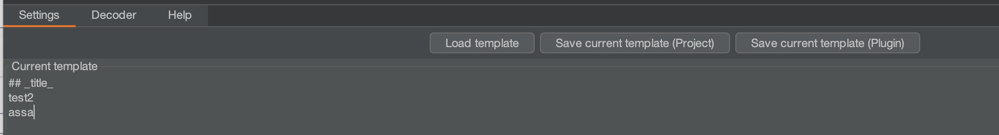

# Message Editor
* Title field - Provide here a step by step description that is used to trigger the request 
  i.e User dashboard > Edit User
  
## Request section
* Headers only - Grab only headers of the request, ignore body part 
* Encode body with base64 - Encode body of the request with Base64 alg, useful for binary files. 
## Response section
* Headers only - Grab only headers of the response, ignore body part
* Encode body with base64 - Encode body of the response with Base64 alg, useful for binary files.

### Response body selection

You can select desired part of the response body in RIO window and click RMB to set it as a `_response_content_` value. 
# BurpSuite Tab
## Settings

On first run, following template is used to generate the output
````
# _title_
URL: _url_
Burpsuite target settings: _target_
```text
REQ:
_request_headers_
_request_content_

RES:
_response_headers_
_response_content_
```
````


Note: You can omit the loading step and define the template in **Current template** text area

If you want to use one burp-suite wide template
1. Go to RIO tab > click load template button > select a template
2. Click save current template (Plugin)

If you want to use project-specific template

1. Go to RIO tab > click load template button > select a template
2. Click save current template (Project)


